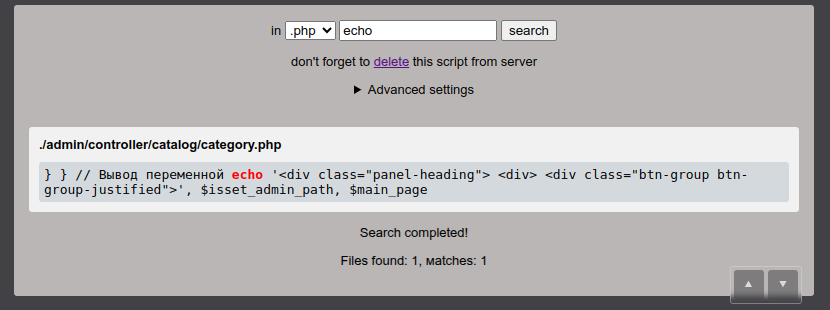

# 🔎 Finder.php
Простой инструмент для поиска текста в исходном коде CMS и самописных сайтов на PHP, размещенных на сервере. Предназначен для веб-мастеров.

  

Позволяет запустить процедуру поиска в PHP, JS, CSS и других текстовых файлах, без необходимости скачивать все содержимое сайта на компьютер. Также избавляет от необходимости подключаться по SSH и прописывать команды в терминале. Данный скрипт старается игнорировать директории с кэшем, ищет текст только в файлах с указанным расширением, позволяет выбрать максимальную глубину вложенности директорий для поиска. Особенно полезен для сайтов без систем управления версиями (Git, и д.р.)

Поддерживает работу в PHP от 5.6 до 8.4 и новее.

## 🚀 Запуск
Интерфейс доступен через браузер.
Файл finder.php загружается в корень сайта, через FTP, SSH или панель хостинга. В браузере вводится ссылка к файлу на сайте в виде https://*адрес сайта*/finder.php?run (вместо "run" можно сохранить в скрипте собственное кодовое слово для запуска)

## 🔎 Поиск
После открытия ссылки на скрипт в браузере, в форме поиска, выберите расширение файла, затем введите искомый текст (от 3 до 50 символов). Нажмите "search". По окончанию поиска, откроется страница с сообщением ниже "Search completed". Если найдены файлы, содержащие искомый текст, отобразятся пути до файлов и отрывок из найденного текста в файле. Обычно поиск не занимает более 20 секунд. Если поиск проходит медленнее, настройте скрипт, чтобы не создавать нагрузки на сервер, и не получить временную блокировку от хостинга. Если поиск не завершится за 50 секунд, поиск автоматически прервется ошибкой "Search time has expired!".

## 🔧 Настройки скрипта
В скрипте доступны для настройки:
- список игнорируемых файлов
- список игнорируемых директорий
- список доступных для поиска расширений файла
- список файлов с чувствительными данными (содержимое файлов не будет выводиться в результатах поиска)
- путь к файлам сайта
- выключатель поиска по символьным ссылкам
Через блок настроек:
- режим сканирования 
- максимальная глубина поиска
- лимит размера файла
- широкоэкранный режим

Списки не доступны через браузер, настройка производится в константах в скрипте. Это позволяет сохранить их один раз локально в самом файле скрипта, и не настраивать их повторно, при каждой процедуре поиска.

В случаях, когда папка с файлами проекта находится за пределами папки Document Root, например в Laravel файлы проекта выше папки "public", можно указать в константе "FOLDER" либо полный путь, либо указать родительскую папку в виде двух точек - "..".

## 🛡️ Защиты от запуска посторонними лицами
GET параметр ?run необходим для запуска скрипта. Название данного параметра можно переименовать в скрипте, для усиления защиты, константа - "STARTER". Данная мера была добавлена еще и для защиты от индексации файла поисковыми роботами.

Скрипт необходимо удалять с сайта сразу, как только завершите процедуру поиска, во избежание запуска посторонними лицами. Если скрипт размещен на сервере более 8 часов назад, скрипт перестанет запускаться из браузера. Необходимо будет загрузить скрипт на сервер заново.

Пути к файлам с чувствительными данными (файлы конфигураций и доступов к бд) хранятся в константе "SENSITIVE_DATA_FILES". Это означает, что содержимое данных файлов не отобразится на странице результатов, чтобы не было возможности совершить кражу доступов и настроек сайта. Будет лишь выведено сообщение, что в данном файле есть искомая строка.

## ⚙ Блок "Дополнительные настройки"
В интерфейсе есть раскрывающийся блок "Advanced settings", в нем доступны следующие элементы:

### 🔬 Режим сканирования

#### Стандартный
Активируется по умолчанию. Если текст в файле отличается хотя бы одной заглавной или строчной буквой от искомого, текст не выводится.

#### Нечувствительный к регистру символов
Запуск поиска текста без учета регистра.

#### Только отображение сканируемых директорий
В данном режиме не запускается чтение содержимого файлов. На странице результата отобразятся только пути к отсканированным директориям. Данным режимом можно отыскать директории, которые необходимо добавить в список игнорирования, чтобы оптимизировать скорость поиска, например директории с изображениями, видео, кэш. На данный режим не действует лимит размера файлов.

### 🚫 Лимит размера файлов
В режимах "Стандартный" и "Нечувствительный к регистру", скрипт соблюдает лимит размера файла. Если файл превышает установленный лимит, он проигнорируется и не будет отсканирован скриптом. Это позволяет снизить нагрузку на сервер, и ускорить поиск. По умолчанию, скрипт не сканирует файлы, больше 128 килобайт. Можно уменьшить лимит до 1 килобайта. Настройка полезна для ускорения поиска на крупных сайтах или PHP фреймворках.

### 📐 Максимальная глубина поиска
Для снижения нагрузки на сайт, во время поиска, можно заранее указать глубину сканирования директорий. Если указать глубину в 4 директории, скрипт не будет открывать директории глубже, например "/local/templates/.default/". Глубина в 1 директорию означает поиск только в корне сайта. Настройка полезна, если уже известно, до какой глубины располагаются искомые файлы, либо для режима вывода только названий директорий. По умолчанию, ограничение в глубину - 12 папок.

### ↔️ Широкоэкранный режим
Максимальная ширина интерфейса увеличивается, чтобы вместить результаты поиска в одну строчку. Рекомендуется для режима отображения директорий. И еще для беглого чтения, среди большого количества результатов поиска.
